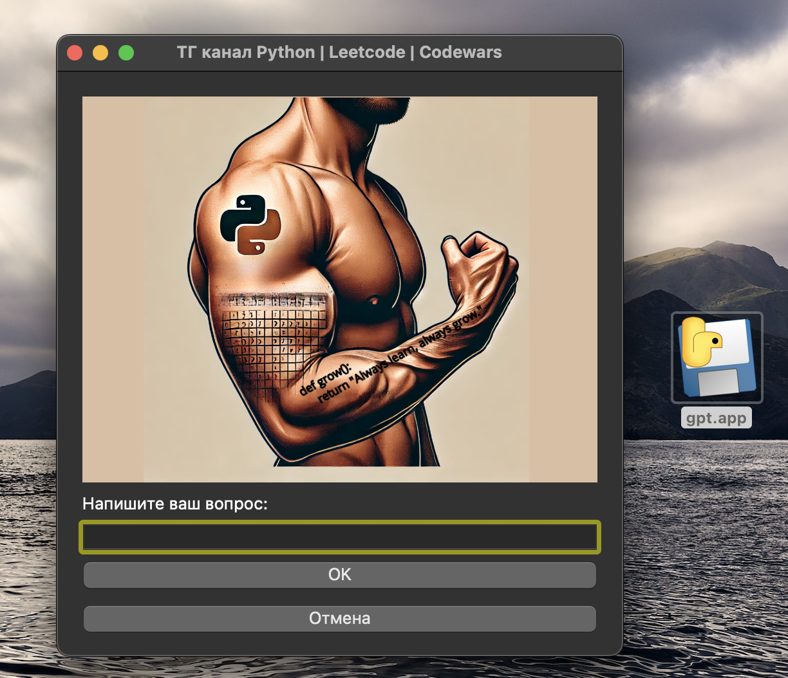

# Mistral-AI-API

## gpt.app — это приложение на Python с использованием PyQt5, которое взаимодействует с API Mistral для обработки текстовых сообщений. 

### Установка
1. **Клонируйте репозиторий:**
   ```bash
   git clone https://github.com/IgorYKovalev/Mistral-AI-API.git
   cd <имя_папки_репозитория>
   
2. Установите виртуальное окружение: `python -m venv <название>`
3. Активируйте виртуальное окружение: `source venv/bin/activate` 
4. Установите зависимости: `pip install -r requirements.txt`
5. Создайте файл config.json в корневой директории проекта со следующим содержимым:
    ```json
    {
        "MISTRAL_API_KEY": "ваш_ключ_API"
    }
    ```
Замените ваш_ключ_API на ваш реальный API-ключ от Mistral, который получили у них на ресурсе.

## Основной функционал
Приложение позволяет пользователю вводить текст, отправлять его в модель Mistral и получать ответ, который затем записывается в лог-файл на рабочем столе.


### Запуск
Находясь в папке проекта, запустите файл в терминале gpt.py
`python gpt.py`

### Компиляция в исполняемый файл
Если хотите создать исполняемый файл gpt.app, используйте PyInstaller. Выполните следующие команды:
Установка:
`pip install pyinstaller`
`pyinstaller --onefile --noconsole --add-data "/path/to/your/image.png:." --add-data "config.json:." --add-data "input_window.py:." gpt.py`

Или можете пользоваться файлом [gpt.app](gpt.app)
